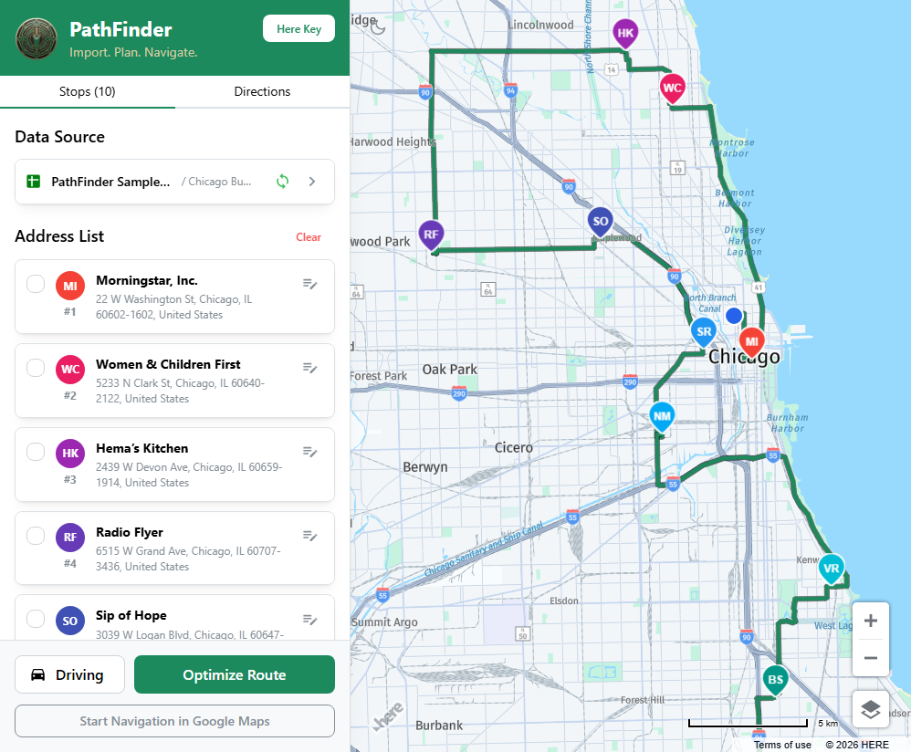

# PathFinder: Intelligent Route Optimizer

PathFinder is a powerful, web-based route optimization tool designed for delivery drivers, field service professionals, and anyone needing to visit multiple locations efficiently. It integrates seamlessly with Google Sheets and utilizes the HERE Maps API to provide high-performance geocoding, interactive mapping, and optimal route generation.

## Key Features

- **🎯 Multi-Stop Optimization**: Automatically reorders your stops to minimize travel time and distance.
- **📊 Google Sheets Integration**: Sync addresses directly from a spreadsheet and update delivery status (checkboxes) back to the sheet in real-time.
- **⌨️ Manual Entry**: Paste lists of addresses to quickly parse and map them.
- **🚗 Multiple Transit Modes**: Optimize routes for Car, Truck, Bicycle, or Pedestrian travel.
- **🗺️ Interactive Mapping**: High-performance map with turn-by-turn directions.
- **📱 Mobile Ready**: Responsive design with a bottom-sheet interface for on-the-go navigation.
- **⚡ Full directions**: Turn-by-turn directions to guide you between stops.

## User Guide

### 1. Configure HERE API Key

When you first launch the app, you will be prompted to enter your **HERE Maps API Key**.

- Get a free key at [platform.here.com](https://platform.here.com/portal/sign-up).
   1. Create an account
   2. Enter payment credentials, which are required by the platform.  The HERE Maps API has a generous [free quota](https://www.here.com/get-started/pricing) and normal usage should always be free.
   3. Create a new Application (Access Manager, Apps, Register New App) with any name.
   4. Create an API key and copy it to the clipboard.
   5. Open [PathFinder.SLaks.net](https://pathfinder.slaks.net) and paste the API key.
- The key is stored safely in your browser's local storage.
- You can generate a **Shareable Link** to quickly set up the app on other devices without re-typing the key.

### 2. Importing Data

- **Google Sheets**: Click "Connect Google Sheet" to select a spreadsheet. PathFinder automatically identifies address and name columns.
- **Manual Parse**: Paste any text containing addresses into the "Paste Text" area. The AI-powered parser will extract valid stops automatically.

### 3. Manipulating Data

You can check any address to mark it as completed and exclude it from navigation.  If your spreadsheet has a column like "Delivered" or "Completed", the checkbox will sync to that column.

You can also click the edit button to see and edit the full spreadsheet row for any address.

### 4. Optimizing Your Route

- Check any entries that are already completed.
  - If your sheet has a checkbox column like "Delivered" or "Complete", the checkboxes will automatically sync to that column.
  - Otherwise, checked items won't be remembered anywhere.
- Select your **Transit Mode** (e.g., Driving or Walking) from the dropdown in the footer.
- Click **Optimize Route**. PathFinder will calculate the most efficient sequence starting from your current location.
- You can then click **Start Navigation** to navigate to the first stop in Google Maps.

### 5. Turn-by-Turn Directions

Switch to the **Directions** tab in the sidebar to see detailed instructions for your current path. Hovering over a direction step will highlight that segment on the map.

## Contributing

Contributions are welcome! Please feel free to submit a Pull Request.

## License

This project is licensed under the MIT License.
